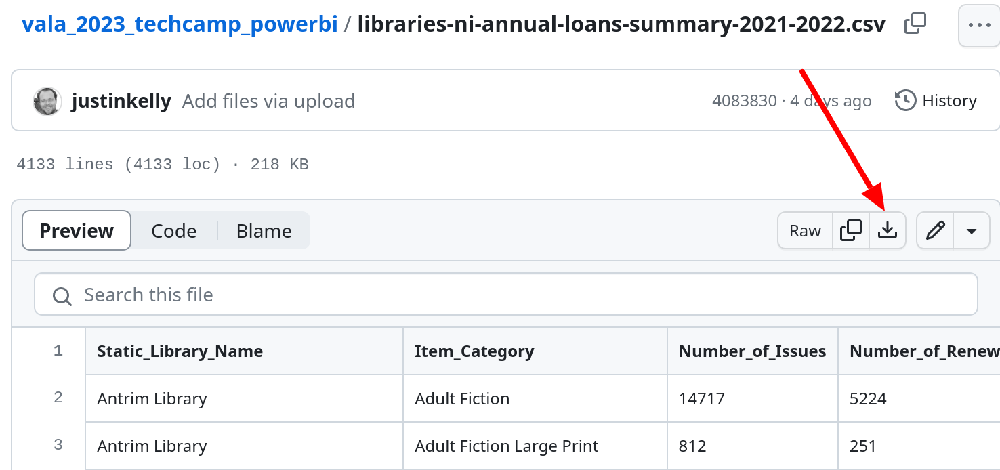

# VALA TechCamp 2023 PowerBI files

Files for the PowerBI training at VALA TechCamp 2023 

Download all files as zip: [https://github.com/justinkelly/vala_2023_techcamp_powerbi/raw/main/vala-file-download.zip](https://github.com/justinkelly/vala_2023_techcamp_powerbi/raw/main/vala-file-download.zip)

Loans CSV: [https://github.com/justinkelly/vala_2023_techcamp_powerbi/blob/main/libraries-ni-annual-loans-summary-2021-2022.csv](https://github.com/justinkelly/vala_2023_techcamp_powerbi/blob/main/libraries-ni-annual-loans-summary-2021-2022.csv)

## How to download CSV

Go to the [Loans CSV](https://github.com/justinkelly/vala_2023_techcamp_powerbi/blob/main/libraries-ni-annual-loans-summary-2021-2022.csv) file and click the Download icon (refer image below) to download the loans csv file

## Links

* Files:  [bit.ly/vala23-powerbi-files](https://bit.ly/vala23-powerbi-files)
* Notes: [bit.ly/vala23-powerbi-notes](https://bit.ly/vala23-powerbi-notes)
* Slides: [bit.ly/vala23-powerbi-slides](https://bit.ly/vala23-powerbi-slides)

## Info
Source info for the library files:

Libraries NI Annual Loans Summary
* [https://data.world/datagov-uk/47ee1f4e-861b-46d0-85ab-33be2cf6bc17](https://data.world/datagov-uk/47ee1f4e-861b-46d0-85ab-33be2cf6bc17)

Emily Brontë file
* [https://www.bl.uk/collection-metadata/downloads](https://www.bl.uk/collection-metadata/downloads)
* Literature datasets >  Emily Brontë CSV (ZIP 909 KB) Updated July 2023

